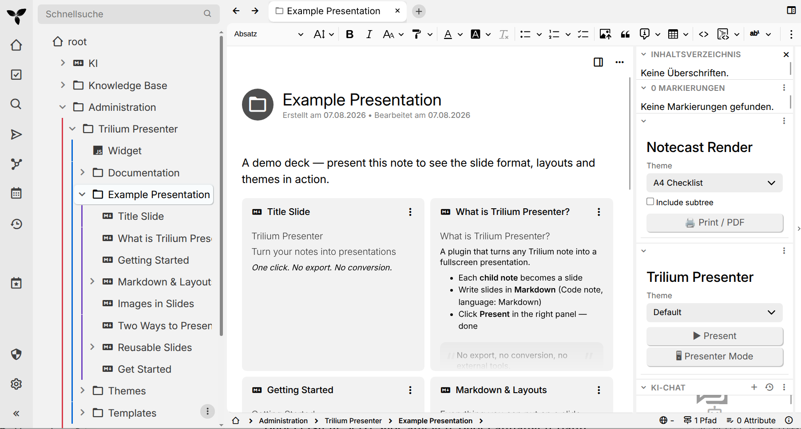

# trilium-notecast-render

[](https://github.com/Stefan-Schmidbauer/trilium-notecast-render/releases/latest)
[](LICENSE)
[](https://triliumnotes.org)
[](https://github.com/Stefan-Schmidbauer/trilium-notecast-mcp)

A Trilium Notes plugin that renders a note to a **print-ready document** (e.g.
DIN A4) using a selectable print theme, then hands it to the browser's print
dialog — save as PDF or print on paper.



The **render specialist** of the **Notecast** family. The shared
[label contract](https://github.com/Stefan-Schmidbauer/trilium-notecast-mcp/blob/main/docs/notecast-contract.md)
lives in the MCP repo and is binding on all three:

| Repo | Role |
|---|---|
| [`trilium-notecast-mcp`](https://github.com/Stefan-Schmidbauer/trilium-notecast-mcp) | authors typed notes (`#notecastType`) |
| [`trilium-presenter-plugin`](https://github.com/Stefan-Schmidbauer/trilium-presenter-plugin) | presents a subtree on screen |
| **`trilium-notecast-render`** (this repo) | **renders a note to print/PDF in a chosen theme** |

The three meet only inside Trilium, through the shared `notecast` labels.

## What it does

1. You open (mark) a note.
2. The widget reads the note's type from **`#notecastInstance`** and offers the
   matching print themes (`#notecastTheme=<typeId>`) in a dropdown. A note
   without `#notecastInstance` (hand-made, not authored by the MCP) falls back
   to *all* print themes.
3. You pick a theme and press **Print**. The widget renders the note's content,
   wraps it in the theme's CSS (with `@page` A4 rules and page breaks), opens it
   in a new window, and calls `window.print()`.

**Pandoc fenced divs** are understood — `::: {.columns}`, `::: {.column}`,
`::: {.notes}`, `::: {.page-break}` — and produce the same structure the
presenter does, so a slide prints with its columns side by side instead of
showing the `:::` markers as text. Speaker notes are collected and appended in
their own block at the end; `slide.css` sets them apart as a handout section
(add `display: none` there to print without them).

**Images** come along: an image is an attachment of the note that shows it, and
a bare file name in the content (``) is matched against
the note's attachment titles — the same lookup the presenter does, so a note
authored by the MCP prints the way it presents. HTML notes keep the
`api/attachments/…` URL Trilium put there. Either way the URL is made absolute,
because the print window is opened from a `blob:` URL and a relative one would
404. A file name that matches no attachment prints a visible
`[missing image: …]` placeholder rather than an invisible broken image.

Decisions baked in (from the Notecast design discussion):

- **Scope:** the active note, or — with the **Include subtree** checkbox — the
  note and everything below it, one page per note in tree order. The checkbox
  only appears where there is a subtree. This is type-agnostic on purpose: a
  folder of meeting notes becomes a booklet by the same path a deck becomes a
  handout, which is why handouts left the presenter and landed here.
- **Mechanism:** browser print. No PDF library, **no backend scripting** — see
  below.
- **Theme choice:** filtered by the note's `#notecastInstance`; you pick from that
  type's themes. The theme's **note title** is its name (`A4 Print`,
  `A4 Compact`); its **content** is the print CSS.

## No backend scripting — by design

TriliumNext v0.104 disabled backend scripting (`api.runOnBackend`) by default.
This plugin is therefore **frontend-only from day one**: note access via froca
(`api.getNote`, `await note.getContent()`, `await note.getAttachments()`,
`note.getLabelValue(...)`), theme discovery via `api.searchForNotes(...)`,
output via `window.print()`. Nothing here needs the `[Security]
backendScriptingEnabled` toggle. (The presenter learned this the hard way; we
start clean.)

## The `#notecastInstance` marker

`#notecastType=<id>` marks a type **definition** (read by the MCP).
`#notecastInstance=<id>` marks an **instance** — a note *of* that type — and is
what this renderer reads to know which themes to offer. It is deliberately a
different label: if instances carried `#notecastType`, the MCP's type lookup
would collide with every instance. The MCP stamps `#notecastInstance=<note_type>`
automatically on every note it creates.

## What it ships

Importing the zip installs the widget, six document types, one print theme per
type, and the documentation:

| Type id | Document | Created as | Print theme |
|---|---|---|---|
| `note` | A short captured thought | text (HTML) | A4 Note |
| `kbEntry` | A knowledge base article | markdown | A4 Knowledge Base |
| `meetingNote` | Minutes of one meeting | markdown | A4 Meeting Note |
| `checklist` | Steps to tick off on paper | markdown | A4 Checklist |
| `itTip` | One problem, one fix, one page | markdown | A4 IT Tip |
| `letter` | Formal letter, window envelope | text (HTML) | A4 Letter |

Plus a print theme for `slide` — that type is owned by the presenter; this only
adds a way to print one as a landscape handout.

These are real, owned types, not samples: per the contract, the plugin that gives
a type a visible form owns and ships its definition. The renderer takes the
general-purpose document types because anything can be printed. Adding your own
is a matter of tagging a note — see [docs/note-types.md](docs/note-types.md).

## Development

```bash
pip install -r requirements-dev.txt   # pinned; the widget tests need nothing
ruff check .                # lint, same versions CI uses
pytest                      # the import zip matches the note tree it declares
node --test                 # the widget's escaping and rendering helpers
python3 build-zip.py        # build the archive locally
```

Both suites run in CI on every push. Neither needs a Trilium instance:

- **`tests/test_build_zip.py`** builds the real archive and checks it against its
  own manifest — every declared file present, every declared label emitted. That
  second check exists because the opposite once shipped: while `meta.json` was
  exported from a live Trilium and the files copied beside it, the two drifted
  for months.
- **`tests/widget.test.js`** loads `src/widget.js` in node behind a two-method
  Trilium stub (`tests/stub-trilium.js`) and exercises the helpers that build the
  generated document. The window that document opens in is same-origin with
  Trilium, so the escaping there is a security boundary, not cosmetics.

This does **not** replace the repo rule that widget code is verified by running
it in Trilium — the tests cover the string-producing helpers, not the UI.

## Layout

```
src/widget.js      — the render widget (frontend NoteContextAwareWidget)
types/             — type definitions (#notecastType=<id>): the authoring formats
themes/            — print CSS; _base-print.css + one file per type
docs/              — user documentation, shipped inside the zip
build-zip.py       — declares the note tree; builds the zip and its meta.json
```

## Install / develop

The plugin lives as notes inside Trilium and is installed from a `.zip`:

```bash
python3 build-zip.py       # -> trilium-notecast-render.zip
```

Then import it in Trilium (**Note tree → … → Import into note**). Trilium
neutralises executable labels in anything you import, so the widget note arrives
carrying `#disabled:widget`: rename that attribute to `#widget`, then reload.
Until you do, the plugin is installed but inert and no widget appears.

**The repo is the source of truth; Trilium is where it runs.** Edit files here,
push them into Trilium via ETAPI to test, then commit. Nothing gets committed
that has never run in Trilium — but git keeps the authoritative copy, so a
change cannot be lost by forgetting to sync it back.

Unlike the presenter, `meta.json` is not exported from a live instance. The note
tree — titles, types, mimes and above all the labels — is declared in
`build-zip.py`, which emits the archive and its metadata together. One source, so
the two cannot drift.

## Status

Working end to end — types, themes, docs, packaging and the widget itself have
been exercised in Trilium: pick a note, pick a theme, print. It is young, so
expect the rough edges of a first public release rather than those of a
long-settled plugin; the automated tests cover the string-producing helpers, not
the UI. Issues and feedback are welcome.

## Documentation

See the [docs/](docs/) folder:

- [Getting Started](docs/getting-started.md) — install, first print, the theme picker
- [Note Types](docs/note-types.md) — the six shipped types, and defining your own
- [Themes](docs/themes.md) — writing print CSS, and how a theme note is assembled
- [About](docs/about.md) — the Notecast family, author, license

## Author

**Stefan Schmidbauer** — [GitHub](https://github.com/Stefan-Schmidbauer)

Built with [Claude Code](https://claude.ai/claude-code) as co-author.

## License

MIT — see [LICENSE](LICENSE).
